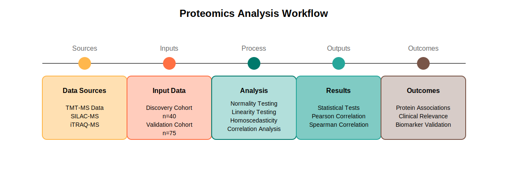
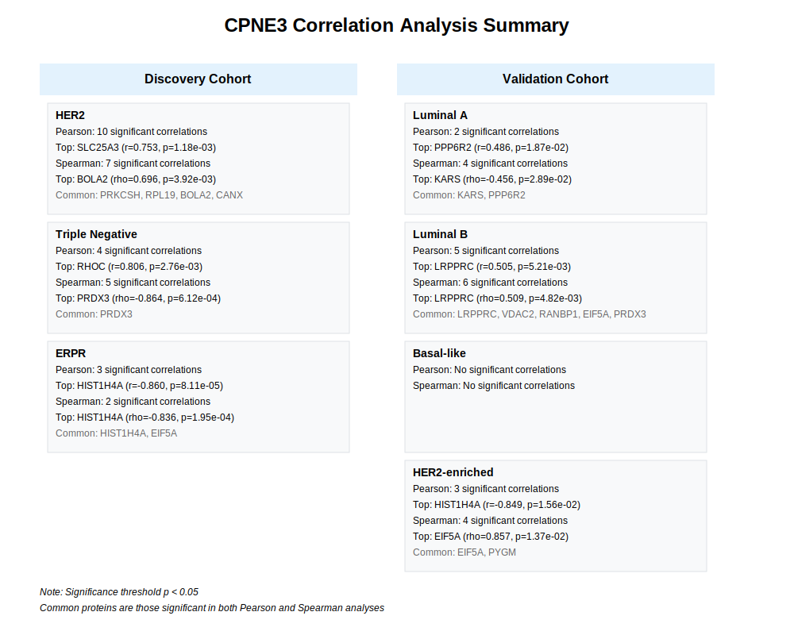

# Correlation of CPNE3-Associated Proteins in HER2-Positive Breast Cancer

## Background
An aggressive subtype of breast cancer, characterised by overexpression of ERBB2/HER2, affects 20-30% of cases despite modern therapeutic interventions. While targeted treatments exist, complex resistance mechanisms and varied patient responses indicate significant knowledge gaps in our understanding of underlying molecular processes. 

Recent proteomic studies have unveiled intricate molecular networks associated with oncogenic transformation. Within this context, CPNE3, a calcium-dependent phospholipid-binding protein with high expression in HER2 positive breast cancer cell, has emerged as a significant player in signaling pathways and cellular processes.

## Study Design
This analysis examines protein correlations based on 52 proteins initially identified in ERBB2 overexpressing Human Mammary Luminal Epithelial Cells (HMLEC 3.6). These proteins were identified as differentially expressed following CPNE3 knockdown, providing the foundation for investigating their relationships in clinical samples.

## Dataset Overview

### Discovery Cohort (n=40)
- Composition:
  - HER2-positive (n=15)
  - ERPR-positive (n=14)
  - Triple Negative (n=11)
- 36 of 52 target proteins consistently quantified

### Validation Cohort (n=75)
- Composition:
  - Luminal A (n=23)
  - Luminal B (n=29)
  - Basal-like (n=19)
  - HER2-positive (n=6)
- 45 of 52 target proteins consistently quantified

## Analysis Workflow


## Implementation Details
- **R Version**: 4.3.2
- **Key Packages**:
  - stats: Core statistical analysis
  - corrplot: Correlation visualisation
  - car: Statistical testing

## Key Results



## Significance
This analysis bridges the gap between cell line studies and clinical applications by validating protein associations in patient samples. While cell line studies provide initial insights, they are limited by artificial conditions and lack the complexity of the tumor microenvironment. The integration of data from two independent patient cohorts provides robust validation of protein associations and their clinical relevance.

The study's dual approach combines:
1. Statistical Robustness:
   - Comprehensive assumption testing
   - Dual correlation analysis methods
   - Validation across independent cohorts

2. Clinical Relevance:
   - Direct analysis of patient samples
   - Integration of multiple breast cancer subtypes
   - Validation of cell line findings in clinical context

These findings contribute to understanding protein interaction networks in breast cancer, with potential implications for biomarker development and therapeutic strategies.

## Repository Structure
```
.
├── R/
│   ├── analysis.Rmd             # Main analysis R Markdown file
│   └── statistical_analysis_functions.R
├── data/
│   ├── discovery_cohort/        # n=40
│   │   ├── 37POI-ERPR.csv
│   │   ├── 37POI-Her2.csv
│   │   └── 37POI-TN.csv 
│   └── validation_cohort/       # n=75
│       ├── 45POI-Basal-like.csv
│       ├── 45POI-Her2.csv
│       ├── 45POI-Luminal_A.csv
│       └── 45POI-Luminal_B.csv 
├── diagrams/
│   ├── research-workflow-sipoc.svg
│   ├── statistical_assumptions_summary.svg
│   └── cpne3_correlation_summary.svg
├── outputs/
│   ├── html/                    # HTML report outputs
│   │   └── analysis.html           # Knitr HTML Output
│   ├── correlation_plots/
│   │   ├── discovery_cohort_correlations.pdf
│   │   ├── validation_cohort_correlations.pdf
│   │   ├── discovery_cohort_spearman_correlations.pdf
│   │   └── validation_cohort_spearman_correlations.pdf
│   └── results/
│       ├── discovery_cohort_correlations.txt
│       ├── validation_cohort_correlations.txt
│       ├── discovery_cohort_spearman_correlations.txt
│       └── validation_cohort_spearman_correlations.txt
├── docs/
│   └── METHODS.md
├── README.md
└── LICENSE
```

## Statistical Methods References
1. Pearson, K. (1895). *Proceedings of the Royal Society of London, 58*, 240-242.
2. Spearman C. (1904). *American Journal of Psychology, 15*(1), 72-101.
3. Shapiro, S.S. and Wilk, M.B. (1965). *Biometrika, 52*, 591-611.
4. Breusch, T.S., and Pagan, A.R. (1979). *Econometrica, 47*(5), 1287-94.
5. Bewick V., et al. (2003). *Critical Care, 7*(6):451-9.

## Usage
1. Clone the repository
2. Install required R packages:
   ```R
   install.packages(c("corrplot", "stats", "car"))
   ```
3. Run the analysis in R Studio:
   ```R
   # Open and run the R Markdown file
   R/analysis.Rmd
   ```

## License
This project is licensed under the MIT License - see the LICENSE file for details.